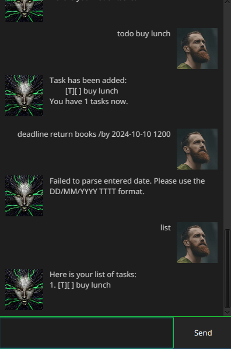

# Shodan User Guide

SHODAN is a bot that helps manage your tasks! 🤖

You can:
- Save _varied_ types of tasks
- Search for them easily
- ~~Delete your tasks~~

# Quick Start
1. Make sure that you have [Java 11](https://www.oracle.com/java/technologies/javase/jdk11-archive-downloads.html) installed on your computer.
2. Download the latest version of `Shodan.jar` [here](https://github.com/angsongyee/ip/releases/tag/A-BetterGui).
3. Copy the file to the folder you want to use as the home folder for Shodan.
4. Open a command terminal, cd into the folder you put the jar file in, and use the `java -jar Shodan.jar` command to run the application.
   
## Command Reference

| Command  | Format                                | Example |
|----------|---------------------------------------|---------|
| Bye      | `bye`                                 | `bye`
| List     | `list`                                | `list`
| Todo     | `todo NAME`                           | `todo read book` 
| Deadline | `deadline NAME /by DATE`              | `deadline return book /by 1/1/2025 1200`
| Event    | `event NAME /from DATE /to DATE`      | `event attend meeting /from 1/1/2025 1200 /to 1/1/2025 1300`
| Mark     | `mark NUM`                            | `mark 1` 
| Unmark   | `unmark NUM`                          | `unmark 1`
| Delete   | `delete NUM`                          | `delete 1`
| Find     | `find KEYWORD [MORE_KEYWORDS]`        | `find book`   `find todo`

# Commands

## View all tasks: `list`
Lists all the tasks that you have entered.

Format: `list`

## Add a task: `todo`, `deadline`, `event`
You can add different types of tasks, depending on your needs.

  * `Todo` represents a task that only has a name.
  * `Deadline` represents a task which needs to be completed by a certain date.
  * `Event` represents a task that occurs during a period of time.

Format:
  - `todo NAME`
  - `deadline NAME /by DATE`
  - `event NAME /from DATE /to DATE`

`DATE` must be of the format `DD/MM/YYYY TTTT`, e.g. `1/1/2024 1200`.

Examples:
  - `deadline return book /by 1/1/2025 1200`
  - `event attend meeting /from 1/1/2025 1200 /to 1/1/2025 1300`

## Set the completion status of a task: `mark`, `unmark`
Mark a task as completed, or a completed task as not done.

Format:
  - `mark NUM`
  - `unmark NUM`

This command will (un)mark the `NUM`th element in the list, which can be viewed using the `list` command.
Does nothing if an already completed task is marked as completed.

Examples:
  - `mark 1`
  - `unmark 2`

## Delete a task: `delete`
Deletes the specified task.

Format: `delete NUM`

This command will delete the `NUM`th element in the list, which can be viewed using the `list` command.

Examples: `delete 1`

## Search for tasks: `find`
Search for tasks using keywords, or task types.

Format: `find KEYWORDS [MORE_KEYWORDS]`

The `find` command searches for all tasks that match the given keywords. Partial keyword matching is supported,
and using one of the special keywords `todo`, `deadline`, `event` will return all tasks of that type.

Examples:
  - `find book`
  - `find todo book`

## Things to note
- Shodan will automatically save your entered tasks to the filesystem as you interact with it. It is recommended to place your `Shodan.jar` in its own folder, as the save files will be stored alongside the executable.
